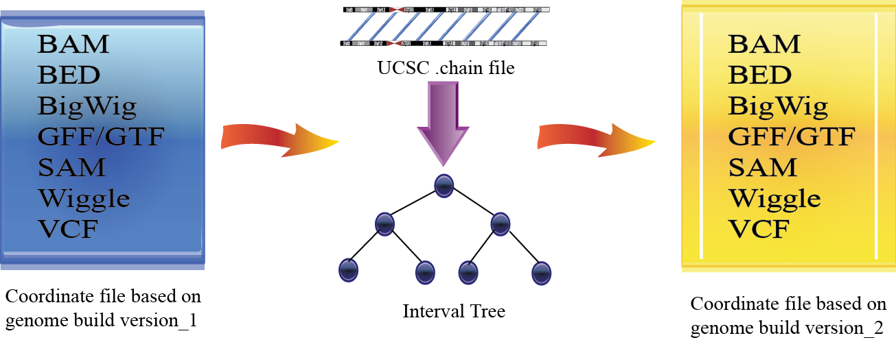

.. toctree::
   :maxdepth: 2
   

.. CrossMap documentation master file, created by
   sphinx-quickstart on Thu Nov 06,  2018.
   You can adapt this file completely to your liking, but it should at least
   contain the root `toctree` directive.

.. image:: _static/logo.png
   :height: 150px
   :width: 750 px
   :scale: 50 %
   :alt: alternate text

What is CrossMap ?
====================

CrossMap is a program for genome coordinates conversion between *different assemblies*
(such as `hg18 (NCBI36) <http://www.ncbi.nlm.nih.gov/assembly/2928/>`_   <=> `hg19 (GRCh37) <http://www.ncbi.nlm.nih.gov/assembly/2758/>`_). 
It supports commonly used file formats including BAM, CRAM, SAM, Wiggle, BigWig, BED, GFF, GTF and VCF.

How CrossMap works?
===================

Release history
===================
* 05/04/2020: Release version 0.4.2.

 * Support `GVCF <https://gatk.broadinstitute.org/hc/en-us/articles/360035531812-GVCF-Genomic-Variant-Call-Format>`_ file conversion.
 
* 03/24/2020: Release version 0.4.1.

 * fix the bug when there are consecutive TABs in the input MAF file.

* 10/09/2019: Release version 0.3.8.

 * The University of California holds the copyrights in the UCSC chain files. As requested by UCSC, all UCSC generated chain files will be permanently removed from this website and the CrossMap distributions.

* 07/22/2019: Release version 0.3.6.
  
  * Support MAF (mutation annotation format). 
  * Fix error "TypeError: AlignmentHeader does not support item assignment (use header.to_dict()" when lifting over BAM files. User does not need to downgrade pysam to 0.13.0 to lift over BAM files. 

* 04/01/2019: Release version 0.3.4.

 * Fix bugs when chromosome IDs (of the source genome) in chain file do not have 'chr' prefix (such as "GRCh37ToHg19.over.chain.gz"). This version also allows CrossMap to detct if a VCF mapping was inverted, and if so reverse complements the altenerative allele (Thanks Andrew Yates). Improve wording. 

* 01/07/2019: Release version 0.3.3.
 
 * Version 0.3.3 is exactly the same as Version 0.3.2. The reason to release this version is that CrossMap-0.3.2.tar.gz was broken when uploading to pypi.

* 12/14/18: Release version 0.3.2. 
 
 * Fix the key error problem (e.g  *KeyError: "sequence 'b'7_KI270803v1_alt'' not present"*). This error happens when a locus from the orignal assembly is mapped to a "alternative", "unplaced" or "unlocalized" contig in the target assembly, and this "target contig" does not exist in your target_ref.fa. In version 0.3.2, such loci will be silently skipped and saved to the ".unmap" file. 
 
* 11/05/18: Release version 0.3.0:

 * v0.3.0 or newer will Support Python3. Previous versions support Python2.7.*
 * add `pyBigWig <https://github.com/deeptools/pyBigWig>`_ as a dependency.  

Installation
==================

Use pip to install CrossMap
-----------------------------

::

 pip3 install CrossMap	#Install CrossMap supporting Python3
 pip2 install CrossMap	#Install CrossMap supporting Python2.7.*

Use pip to upgrade CrossMap
-----------------------------

::

 pip3 install CrossMap --upgrade	#upgrade CrossMap supporting Python3
 pip2 install CrossMap --upgrade	#upgrade CrossMap supporting Python2.7.*

Input and Output
=================

Chain file
-----------

A `chain file <https://genome.ucsc.edu/goldenPath/help/chain.html>`_ describes a pairwise alignment between two reference assemblies. UCSC and Ensemble chain files are available:

1. **UCSC chain files** 

 * Chain files from hg38 (GRCh38) to hg19 and all other organisms: http://hgdownload.soe.ucsc.edu/goldenPath/hg38/liftOver/
 * Chain File from hg19 (GRCh37) to hg17/hg18/hg38 and all other organisms: http://hgdownload.soe.ucsc.edu/goldenPath/hg19/liftOver/
 * Chain File from mm10 (GRCm38) to mm9 and all other organisms: http://hgdownload.soe.ucsc.edu/goldenPath/mm10/liftOver/ 

2. **Ensembl chain files** 

 * Human to Human: ftp://ftp.ensembl.org/pub/assembly_mapping/homo_sapiens/
 * Mouse to Mouse: ftp://ftp.ensembl.org/pub/assembly_mapping/mus_musculus/
 * Other organisms: ftp://ftp.ensembl.org/pub/assembly_mapping/

User Input file
----------------

CrossMap supports the following file formats.
 
1. `BAM <http://samtools.sourceforge.net/SAMv1.pdf>`_, `CRAM <https://samtools.github.io/hts-specs/CRAMv3.pdf>`_, or `SAM <http://samtools.sourceforge.net/SAMv1.pdf/>`_
2. `BED <http://genome.ucsc.edu/FAQ/FAQformat.html#format1>`_ or BED-like. (BED file must has at least 'chrom', 'start', 'end')
3. `Wiggle <http://genome.ucsc.edu/goldenPath/help/wiggle.html>`_ ("variableStep", "fixedStep" and "bedGraph" formats are supported)
4. `BigWig <http://genome.ucsc.edu/goldenPath/help/bigWig.html>`_
5. `GFF <http://genome.ucsc.edu/FAQ/FAQformat.html#format3>`_ or `GTF <http://genome.ucsc.edu/FAQ/FAQformat.html#format4>`_
6. `VCF <http://vcftools.sourceforge.net/index.html>`_  
7. `GVCF <https://gatk.broadinstitute.org/hc/en-us/articles/360035531812-GVCF-Genomic-Variant-Call-Format>`_
8. `MAF <https://docs.gdc.cancer.gov/Data/File_Formats/MAF_Format/>`_

Output file
----------------

Format of Output files depends on the input format

==============  =========================================================================================
Input_format        Output_format         
==============  =========================================================================================
BED             BED (Genome coordinates will be updated)
BAM             BAM (Genome coordinates, header section, all SAM flags, insert size will be updated)
CRAM			BAM (require pysam >= 0.8.2)
SAM             SAM (Genome coordinates, header section, all SAM flags, insert size will be updated)
Wiggle          BigWig
BigWig          BigWig
GFF		        GFF (Genome coordinates will be updated to the target assembly)
GTF             GTF (Genome coordinates will be updated to the target assembly)
VCF             VCF (header section, Genome coordinates, reference alleles will be updated)
GVCF			GVCF (header section, Genome coordinates, reference alleles will be updated)
MAF				MAF (Genome coordinates and reference alleles will be updated)
==============  =========================================================================================

Usage
=============

Run CrossMap.py **without** any arguments will print help message::
 

 $ python CrossMap.py
 
 Program: CrossMap (v0.4.2)

 Description:
  CrossMap is a program to convert genome coordinates between different reference
  assemblies (e.g. from human hg18 to hg19 or vice versa). The supported file
  formats include BAM, BED, BigWig, CRAM, GFF, GTF, GVCF, MAF (mutation annotation
  format), SAM, Wiggle and VCF.

 Usage: CrossMap.py <command> [options]

	 bam	convert BAM, CRAM or SAM format file.
	 bed	convert BED, bedGraph or other BED-like file.
	 bigwig	convert BigWig file.
	 gff	convert GFF or GTF format file.
	 gvcf	convert GVCF file.
	 maf	convert MAF (mutation annotation format) file.
	 vcf	convert VCF file.
	 wig	convert Wiggle or bedGraph format file.
	   
Run CrossMap.py **with** a command keyword will print help message for the command. For example::

 $ python CrossMap.py bed

 #Screen output
 
Usage
-----
  CrossMap.py bed chain_file input.bed [output_file]

 Description
 -----------
  Convert BED format file. The "chain_file" and "input.bed" can be regular or
  compressed (*.gz, *.Z, *.z, *.bz, *.bz2, *.bzip2) file, local file or URL
  (http://, https://, ftp://) pointing to remote file. BED format file must have
  at least 3 columns (chrom, start, end). If  no "output_file" is specified,
  output will be directed to the screen (console).

 Example1 (write output to file)
 -------------------------------
  CrossMap.py bed hg18ToHg19.over.chain.gz test.hg18.bed test.hg19.bed

 Example2 (write output to screen)
 ---------------------------------
  CrossMap.py bed hg18ToHg19.over.chain.gz test.hg18.bed

Convert BED format files
-------------------------
A `BED <http://genome.ucsc.edu/FAQ/FAQformat.html#format1>`_ (Browser Extensible Data) file
is a tab-delimited text file describing genome regions or gene annotations.
It consists of one line per feature, each containing 3-12 columns.
CrossMap converts BED files with less than 12 columns to a different assembly by updating the
chromosome and genome coordinates only; all other columns remain unchanged. Regions from old
assembly mapping to multiple locations to the new assembly will be split.  For 12-columns BED
files, all columns will be updated accordingly except the 4th column (name of bed line), 5th
column (score value) and 9th column (RGB value describing the display color). 12-column BED
files usually define multiple blocks (e.g. exons); if any of the exons fails to map to a new
assembly, the whole BED line is skipped. 

The input BED file can be plain text file, compressed file with extension of .gz, .Z, .z,
.bz, .bz2 and .bzip2, or even a URL pointing to accessible remote files (http://, https://
and ftp://). Compressed remote files are not supported. The output is a BED format file with
exact the same number of columns as the original one.

Standard `BED <http://genome.ucsc.edu/FAQ/FAQformat.html#format1>`_ format has 12 columns, but CrossMap also supports BED-like formats:

* BED3: The first 3 columns ("chrom", "start", "end") of BED format file.
* BED6: The first 6 columns ("chrom", "start", "end", "name", "score", "strand") of BED format file.
* Other: Format has at least 3 columns ("chrom", "start", "end") and no more than 12 columns. All other columns are arbitrary.

NOTE:

1. For BED-like formats mentioned above, CrossMap only updates "chrom (1st column)", "start (2nd column) ", "end (3rd column) " and "strand" (if any). All other columns will keep AS-IS.
2.  Lines starting with '#', 'browser', 'track' will be skipped.
3.  Lines will less than 3 columns will be skipped.
4.  2nd-column and 3-column must be integers, otherwise, the line will be skipped.
5.  "+" strand is assumed if no strand information was found.
6.  For standard BED format (12 columns). If any of the defined exon blocks cannot be uniquely mapped to target assembly, the whole entry will be skipped.
7. "input_chain_file" and "input_bed_file" can be regular or compressed (.gz, .Z, .z, .bz, .bz2, .bzip2) file, local file or URL (http://, https://, ftp://) pointing to remote file.
8. If output_file was not specified, results will be printed to screen (console). In this case, the original bed entries (include items failed to convert) were also printed out.
9. If input region cannot be consecutively mapped target assembly, it will be split.
10. \*.unmap file contains regions that cannot be unambiguously converted. 

Example (run CrossMap with **no** *output_file* specified)::

 $ CrossMap.py bed hg18ToHg19.over.chain.gz test.hg18.bed3

 # Conversion results were printed to screen directly (column1-3 are hg18 based, column5-7 are hg19 based)::
 chr1	142614848	142617697	->	chr1	143903503	143906352
 chr1	142617697	142623312	->	chr1	143906355	143911970
 chr1	142623313	142623350	->	chr1	143911971	143912008

Example (run CrossMap with *output_file* **(test.hg19.bed3)** specified)::

 $ CrossMap.py bed hg18ToHg19.over.chain.gz test.hg18.bed3 test.hg19.bed3

 $ cat test.hg19.bed3
 chr1	143903503	143906352
 chr1	143906355	143911970
 chr1	143911971	143912008

Example (one input region was split because it cannot be consecutively mapped target assembly)::

 $ CrossMap.py bed hg18ToHg19.over.chain.gz test.hg18.bed3

 chr10	81346644	81349952	+	->	chr10	81356692	81360000	+
 chr10	81349952	81364937	+	->	chr10	81360000	81374985	+
 chr10	81364952	81365854	+	->	chr10	81375000	81375902	+
 chr10	81365875	81369946	+	->	chr10	81375929	81380000	+
 chr10	81369946	81370453	+	->	chr10	81380000	81380507	+
 chr10	81370483	81371363	+	->	chr10	81380539	81381419	+
 chr10	81371363	81371365	+	->	chr10	62961832	62961834	+
 chr10	81371412	81371432	+	(split.1:chr10:81371412:81371422:+)	chr10	62961775	62961785	+
 chr10	81371412	81371432	+	(split.2:chr10:81371422:81371432:+)	chrX	63278348	63278358	+

Example (Use **bed** command to convert a bedGraph file, output another bedGraph file. If Use **wig** command to convert a bedGraph file, output a **bigWig** file. )::

 $ CrossMap.py bed hg19ToHg38.over.chain.gz 4_hg19.bgr
 
 chrX	5873316	5873391	2.0	->	chrX	5955275	5955350	2.0
 chrX	5873673	5873710	0.8	->	chrX	5955632	5955669	0.8
 chrX	5873710	5873785	1.4	->	chrX	5955669	5955744	1.4
 chrX	5873896	5873929	0.9	->	chrX	5955855	5955888	0.9
 chrX	5873929	5874004	1.5	->	chrX	5955888	5955963	1.5
 chrX	5874230	5874471	0.3	->	chrX	5956189	5956430	0.3
 chrX	5874471	5874518	0.9	->	chrX	5956430	5956477	0.9

 $ python3 CrossMap.py wig hg19ToHg38.over.chain.gz 4_hg19.bgr output_hg38
 @ 2018-11-06 00:09:11: Read chain_file:  hg19ToHg38.over.chain.gz
 @ 2018-11-06 00:09:12: Liftover wiggle file: 4_hg19.bgr ==> output_hg38.bgr
 @ 2018-11-06 00:09:12: Merging overlapped entries in bedGraph file ...
 @ 2018-11-06 00:09:12: Sorting bedGraph file:output_hg38.bgr
 @ 2018-11-06 00:09:12: Writing header to "output_hg38.bw" ...
 @ 2018-11-06 00:09:12: Writing entries to "output_hg38.bw" ...

.. _bam_conversion:

Convert BAM/CRAM/SAM format files
-----------------------------------
`SAM <http://samtools.sourceforge.net/samtools.shtml#5>`_ (Sequence Alignment Map) format
is a generic format for storing sequencing alignments, and BAM is binary and compressed
version of SAM (`Li et al., 2009 <http://bioinformatics.oxfordjournals.org/content/25/16/2078.full>`_).
`CRAM <https://samtools.github.io/hts-specs/CRAMv3.pdf>`_ was designed to be an efficient reference-based
alternative to the `SAM <http://samtools.sourceforge.net/samtools.shtml#5>`_ and BAM file formats
Most high-throughput sequencing  (HTS) alignments were in SAM/BAM format and many HTS analysis
tools work with SAM/BAM format. CrossMap updates chromosomes, genome coordinates, header
sections, and all SAM flags accordingly.  CrossMap's version number is inserted into
the header section, along with the names of the original BAM file and the chain file.  For
pair-end sequencing, insert size is also recalculated. The input BAM file should be sorted
and indexed properly using samTools (`Li et al., 2009 <http://bioinformatics.oxfordjournals.org/content/25/16/2078.full>`_).
Output format is determined from the input format and BAM output will be sorted and indexed automatically.

Typing command without any arguments will print help message::

 $ CrossMap.py bam
 
 Usage: CrossMap.py bam chain_file input_file output_file [options]
 Note: If output_file == STDOUT or -, CrossMap will write BAM file to the screen
 
 Options:
   -m INSERT_SIZE, --mean=INSERT_SIZE
                         Average insert size of pair-end sequencing (bp).
                         [default=200.0]
   -s INSERT_SIZE_STDEV, --stdev=INSERT_SIZE_STDEV
                         Stanadard deviation of insert size. [default=30.0]
   -t INSERT_SIZE_FOLD, --times=INSERT_SIZE_FOLD
                         A mapped pair is considered as "proper pair" if both
                         ends mapped to different strand and the distance
                         between them is less then '-t' * stdev from the mean.
                         [default=3.0]
   -a, --append-tags     Add tag to each alignment.

Example (Convert BAM from hg19 to hg18)::

 # add optional tags using '-a' (recommend always use '-a' option)
 
 $ CrossMap.py bam -a ../data/hg19ToHg18.over.chain.gz test.hg19.bam test.hg18		
 Insert size = 200.000000
 Insert size stdev = 30.000000
 Number of stdev from the mean = 3.000000
 Add tags to each alignment = True
 @ 2016-10-07 15:29:06: Read chain_file:  ../data/hg19ToHg18.over.chain.gz
 @ 2016-10-07 15:29:07: Liftover BAM file: test.hg19.bam ==> test.hg18.bam
 @ 2016-10-07 15:29:14: Done!
 @ 2016-10-07 15:29:14: Sort "test.hg18.bam" ...
 @ 2016-10-07 15:29:15: Index "test.hg18.sorted.bam" ...
 Total alignments:99914
	QC failed: 0
	R1 unique, R2 unique (UU): 96094
	R1 unique, R2 unmapp (UN): 3579
	R1 unique, R2 multiple (UM): 0
	R1 multiple, R2 multiple (MM): 0
	R1 multiple, R2 unique (MU): 233
	R1 multiple, R2 unmapped (MN): 8
	R1 unmap, R2 unmap (NN): 0
	R1 unmap, R2 unique (NU): 0
	R1 unmap, R2 multiple (NM): 0
  
  
  
# BAM/SAM header sections was updated::

 $ samtools view -H  test.hg19.bam 
 @SQ	SN:chr1	LN:249250621
 @SQ	SN:chr2	LN:243199373
 @SQ	SN:chr3	LN:198022430
 @SQ	SN:chr4	LN:191154276
 @SQ	SN:chr5	LN:180915260
 @SQ	SN:chr6	LN:171115067
 @SQ	SN:chr7	LN:159138663
 @SQ	SN:chr8	LN:146364022
 @SQ	SN:chr9	LN:141213431
 @SQ	SN:chr10	LN:135534747
 @SQ	SN:chr11	LN:135006516
 @SQ	SN:chr12	LN:133851895
 @SQ	SN:chr13	LN:115169878
 @SQ	SN:chr14	LN:107349540
 @SQ	SN:chr15	LN:102531392
 @SQ	SN:chr16	LN:90354753
 @SQ	SN:chr17	LN:81195210
 @SQ	SN:chr18	LN:78077248
 @SQ	SN:chr19	LN:59128983
 @SQ	SN:chr20	LN:63025520
 @SQ	SN:chr21	LN:48129895
 @SQ	SN:chr22	LN:51304566
 @SQ	SN:chrX	LN:155270560
 @SQ	SN:chrY	LN:59373566
 @SQ	SN:chrM	LN:16571
 @RG	ID:Sample_618545BE	SM:Sample_618545BE	LB:Sample_618545BE	PL:Illumina
 @PG	ID:bwa	PN:bwa	VN:0.6.2-r126

 $ samtools view -H  test.hg18.bam
 @HD	VN:1.0	SO:coordinate
 @SQ	SN:chr1	LN:247249719
 @SQ	SN:chr10	LN:135374737
 @SQ	SN:chr11	LN:134452384
 @SQ	SN:chr11_random	LN:215294
 @SQ	SN:chr12	LN:132349534
 @SQ	SN:chr13	LN:114142980
 @SQ	SN:chr13_random	LN:186858
 @SQ	SN:chr14	LN:106368585
 @SQ	SN:chr15	LN:100338915
 @SQ	SN:chr15_random	LN:784346
 @SQ	SN:chr16	LN:88827254
 @SQ	SN:chr17	LN:78774742
 @SQ	SN:chr17_random	LN:2617613
 @SQ	SN:chr18	LN:76117153
 @SQ	SN:chr18_random	LN:4262
 @SQ	SN:chr19	LN:63811651
 @SQ	SN:chr19_random	LN:301858
 @SQ	SN:chr1_random	LN:1663265
 @SQ	SN:chr2	LN:242951149
 @SQ	SN:chr20	LN:62435964
 @SQ	SN:chr21	LN:46944323
 @SQ	SN:chr21_random	LN:1679693
 @SQ	SN:chr22	LN:49691432
 @SQ	SN:chr22_random	LN:257318
 @SQ	SN:chr3	LN:199501827
 @SQ	SN:chr3_random	LN:749256
 @SQ	SN:chr4	LN:191273063
 @SQ	SN:chr4_random	LN:842648
 @SQ	SN:chr5	LN:180857866
 @SQ	SN:chr6	LN:170899992
 @SQ	SN:chr6_random	LN:1875562
 @SQ	SN:chr7	LN:158821424
 @SQ	SN:chr7_random	LN:549659
 @SQ	SN:chr8	LN:146274826
 @SQ	SN:chr8_random	LN:943810
 @SQ	SN:chr9	LN:140273252
 @SQ	SN:chr9_random	LN:1146434
 @SQ	SN:chrM	LN:16571
 @SQ	SN:chrX	LN:154913754
 @SQ	SN:chrX_random	LN:1719168
 @SQ	SN:chrY	LN:57772954
 @RG	ID:Sample_618545BE	SM:Sample_618545BE	LB:Sample_618545BE	PL:Illumina
 @PG	PN:bwa	ID:bwa	VN:0.6.2-r126
 @PG	ID:CrossMap	VN:0.1.3
 @CO	Liftover from original BAM/SAM file: test.hg19.bam
 @CO	Liftover is based on the chain file: ../test/hg19ToHg18.over.chain.gz 

**Optional tags:**

Q
  QC. QC failed.
N
  Unmapped. Originally unmapped or originally mapped but failed to lift over to new assembly.
M
  Multiple mapped. Alignment can be lifted over to multiple places.
U
  Unique mapped. Alignment can be lifted over to only 1 place.
		
**Tags for pair-end sequencing include:**
		
- QF = QC failed
- NN = both read1 and read2 unmapped
- NU = read1 unmapped, read2 unique mapped
- NM = read1 unmapped, multiple mapped
- UN = read1 uniquely mapped, read2 unmap
- UU = both read1 and read2 uniquely mapped
- UM = read1 uniquely mapped, read2 multiple mapped
- MN = read1 multiple mapped, read2 unmapped
- MU = read1 multiple mapped, read2 unique mapped
- MM = both read1 and read2 multiple mapped
		
**Tags for single-end sequencing include:**
		
- QF = QC failed
- SN = unmaped
- SM = multiple mapped
- SU = uniquely mapped

                         
NOTE:

1. All alignments (mapped, partial mapped, unmapped, QC failed) will write to one file. Users can filter them by tags (this is why '-a' is always recommended).
2. Header section will be updated to the target assembly.
3. Genome coordinates and all SAM flags in the alignment section will be updated to the target assembly.
4. if the input is a CRAM file, pysam must >= 0.8.2 
5. Optional fields in the alignment section will not be updated.

Convert Wiggle format files
-----------------------------------
`Wiggle <http://genome.ucsc.edu/goldenPath/help/wiggle.html>`_ (WIG) format is useful for
displaying continuous data such as GC content and the reads intensity of high-throughput sequencing data.
BigWig is a self-indexed binary-format Wiggle file, and has the advantage of supporting random access.
Input wiggle data can be in variableStep (for data with irregular intervals) or fixedStep
(for data with regular intervals). Regardless of the input, the output files are always in bedGraph
format. We export files in bedGraph format because it's more compact than wiggle format, and more importantly,
CrossMap internally transforms wiggle into bedGraph to increase running speed.
 

Typing command without any arguments will print help message::
 
 $ CrossMap.py  wig
 
 Usage
 -----
   CrossMap.py wig chain_file input_wig_file output_prefix
 
 Description
 -----------
   Convert wiggle format file. The "chain_file" can be regular or compressed (*.gz,
   *.Z, *.z, *.bz, *.bz2, *.bzip2) file, local file or URL (http://, https://,
   ftp://) pointing to remote file.  Both "variableStep" and "fixedStep" wiggle
   lines are supported. Wiggle format:
   http://genome.ucsc.edu/goldenPath/help/wiggle.html
 
 Example
 -------
   CrossMap.py wig hg18ToHg19.over.chain.gz test.hg18.wig test.hg19
     
NOTE: 

1. To improve performance, this script calls `GNU "sort"
   <http://www.gnu.org/software/coreutils/manual/html_node/sort-invocation.html>`_ command internally.
   If "sort" command does not exist, CrossMap will exit.    

Convert BigWig format files
-----------------------------------
If an input file is in BigWig format, the output is BigWig format if UCSC’s
'`wigToBigWig <http://hgdownload.cse.ucsc.edu/admin/exe/>`_' executable can be found;
otherwise, the output file will be in bedGraph format.

After v0.3.0, UCSC's wigToBigWig is no longer needed.

Typing command without any arguments will print help message::
 
 $ CrossMap.py  bigwig
 
 Usage
 -----
   CrossMap.py bigwig chain_file input_bigwig_file output_prefix

 Description
 -----------
   Convert BigWig format file. The "chain_file" can be regular or compressed (*.gz,
   *.Z, *.z, *.bz, *.bz2, *.bzip2) file, local file or URL (http://, https://,
   ftp://) pointing to remote file.
 
 Example
 -------
   CrossMap.py bigwig hg18ToHg19.over.chain.gz test.hg18.bw test.hg19
  
Example (Convert BigWig file from hg18 to hg19)::

 $ python CrossMap.py bigwig  hg19ToHg18.over.chain.gz  test.hg19.bw test.hg18
 @ 2013-11-17 22:12:42: Read chain_file:  ../data/hg19ToHg18.over.chain.gz
 @ 2013-11-17 22:12:44: Liftover bigwig file: test.hg19.bw ==> test.hg18.bgr
 @ 2013-11-17 22:15:38: Merging overlapped entries in bedGraph file ...
 @ 2013-11-17 22:15:38: Sorting bedGraph file:test.hg18.bgr
 @ 2013-11-17 22:15:39: Convert wiggle to bigwig ...

NOTE: 

1. To improve performance, this script calls `GNU "sort"
   <http://www.gnu.org/software/coreutils/manual/html_node/sort-invocation.html>`_ command
   internally. If "sort" command does not exist, CrossMap will exit.
2. Output files: output_prefix.bw, output_prefix.bgr, output_prefix.sorted.bgr 

  
Convert GFF/GTF format files
-----------------------------------
`GFF <http://genome.ucsc.edu/FAQ/FAQformat.html#format3>`_ (General Feature Format) is another
plain text file used to describe gene structure. `GTF <http://genome.ucsc.edu/FAQ/FAQformat.html#format4>`_
(Gene Transfer Format) is a refined version of GTF. The first eight fields are the same as
GFF. Plain text, compressed plain text, and URLs pointing to remote files are all supported.
Only chromosome and genome coordinates are updated. The format of the output is determined from
the input.

Typing command without any arguments will print help message::
 
 $ CrossMap.py  gff
  
 Usage
 -----
   CrossMap.py gff chain_file input_gff_file output_file
 
 Description
 -----------
   Convert GFF or GTF format file. The"chain_file" can be regular or compressed
   (*.gz, *.Z, *.z, *.bz, *.bz2, *.bzip2) file, local file or URL (http://,
   https://, ftp://) pointing to remote file. Input file must be in GFF or GTF
   format. GFF format: http://genome.ucsc.edu/FAQ/FAQformat.html#format3 GTF
   format: http://genome.ucsc.edu/FAQ/FAQformat.html#format4
 
 Example1 (write output to file)
 -------------------------------
   CrossMap.py gff  hg19ToHg18.over.chain.gz test.hg19.gtf test.hg18.gtf
 
 Example2 (write output to screen)
 ---------------------------------
   CrossMap.py gff  hg19ToHg18.over.chain.gz test.hg19.gtf

Example (Convert GTF file from hg19 to hg18)::

 $ python CrossMap.py gff  hg19ToHg18.over.chain.gz test.hg19.gtf test.hg18.gtf
 @ 2013-11-17 20:44:47: Read chain_file:  ../data/hg19ToHg18.over.chain.gz
 
 $ head test.hg19.gtf 
 chr1	hg19_refGene	CDS	48267145	48267291	0.000000	-	0	gene_id "NM_001194986"; transcript_id "NM_001194986"; 
 chr1	hg19_refGene	exon	66081691	66081907	0.000000	+	.	gene_id "NM_002303"; transcript_id "NM_002303"; 
 chr1	hg19_refGene	CDS	145334684	145334792	0.000000	+	2	gene_id "NM_001039703"; transcript_id "NM_001039703"; 
 chr1	hg19_refGene	exon	172017752	172017890	0.000000	+	.	gene_id "NM_001136127"; transcript_id "NM_001136127"; 
 chr1	hg19_refGene	CDS	206589249	206589333	0.000000	+	2	gene_id "NM_001170637"; transcript_id "NM_001170637"; 
 chr1	hg19_refGene	exon	210573812	210574006	0.000000	+	.	gene_id "NM_001170580"; transcript_id "NM_001170580"; 
 chr1	hg19_refGene	CDS	235850249	235850347	0.000000	-	0	gene_id "NM_000081"; transcript_id "NM_000081"; 
 chr1	hg19_refGene	CDS	235880012	235880078	0.000000	-	1	gene_id "NM_000081"; transcript_id "NM_000081"; 
 chr1	hg19_refGene	exon	3417741	3417872	0.000000	-	.	gene_id "NM_001409"; transcript_id "NM_001409"; 
 chr1	hg19_refGene	exon	10190773	10190871	0.000000	+	.	gene_id "NM_006048"; transcript_id "NM_006048"; 
 
 $ head test.hg18.gtf
 chr1	hg19_refGene	CDS	48039732	48039878	0.000000	-	0	gene_id "NM_001194986"; transcript_id "NM_001194986";
 chr1	hg19_refGene	exon	65854279	65854495	0.000000	+	.	gene_id "NM_002303"; transcript_id "NM_002303";
 chr1	hg19_refGene	CDS	144046041	144046149	0.000000	+	2	gene_id "NM_001039703"; transcript_id "NM_001039703";
 chr1	hg19_refGene	exon	170284375	170284513	0.000000	+	.	gene_id "NM_001136127"; transcript_id "NM_001136127";
 chr1	hg19_refGene	CDS	204655872	204655956	0.000000	+	2	gene_id "NM_001170637"; transcript_id "NM_001170637";
 chr1	hg19_refGene	exon	208640435	208640629	0.000000	+	.	gene_id "NM_001170580"; transcript_id "NM_001170580";
 chr1	hg19_refGene	CDS	233916872	233916970	0.000000	-	0	gene_id "NM_000081"; transcript_id "NM_000081";
 chr1	hg19_refGene	CDS	233946635	233946701	0.000000	-	1	gene_id "NM_000081"; transcript_id "NM_000081";
 chr1	hg19_refGene	exon	3407601	3407732	0.000000	-	.	gene_id "NM_001409"; transcript_id "NM_001409";
 chr1	hg19_refGene	exon	10113360	10113458	0.000000	+	.	gene_id "NM_006048"; transcript_id "NM_006048"; 

NOTE:

1. Each feature  (exon, intron, UTR, etc) is processed separately and independently, and
   we do NOT check if features originally belonging to the same gene were converted into the same gene.
2. If user wants to lift over gene annotation files, use BED12 format.
3. If no output file was specified, the output will be printed to screen (console). In this case, items failed to convert are also printed out.
  
Convert VCF format files
-------------------------
`VCF <http://www.1000genomes.org/wiki/Analysis/Variant%20Call%20Format/vcf-variant-call-format-version-41>`_
(variant call format) is a flexible and extendable line-oriented text format developed by
the `1000 Genome Project <http://www.1000genomes.org/>`_. It is useful for representing single
nucleotide variants, indels, copy number variants, and structural variants. Chromosomes,
coordinates, and reference alleles are updated to a new assembly, and all the other fields
are not changed.

Typing command without any arguments will print help message::

 $ CrossMap.py  vcf

 usage
 -----
   CrossMap.py vcf chain_file input_VCF_file ref_genome_file output_file
 
 Description
 -----------
   Convert VCF format file. The "chain_file" and "input_VCF_file" can be regular or
   compressed (*.gz, *.Z, *.z, *.bz, *.bz2, *.bzip2) file, local file or URL
   (http://, https://, ftp://) pointing to remote file. "ref_genome_file" is genome
   sequence file of 'target assembly' in FASTA format.
 
 Example
 -------
    CrossMap.py vcf hg19ToHg18.over.chain.gz test.hg19.vcf hg18.fa test.hg18.vcf
    
Example (Convert VCF file from hg19 to hg18)::

 $ python CrossMap.py vcf hg19ToHg18.over.chain.gz test.hg19.vcf ../database/genome/hg18.fa  test.hg18.vcf
 @ 2015-07-27 10:14:23: Read chain_file:  ../data/hg19ToHg18.over.chain.gz
 @ 2013-11-17 20:53:39: Creating index for ../database/genome/hg18.fa
 @ 2015-07-27 10:14:50: Total entries: 497
 @ 2015-07-27 10:14:50: Failed to map: 0 
 
 $ grep -v '#' test.hg19.vcf  |head -10
 chr1	10933566	.	C	G	.	PASS	ADP=13;WT=0;HET=0;HOM=1;NC=0	GT:GQ:SDP:DP:RD:AD:FREQ:PVAL:RBQ:ABQ:RDF:RDR:ADF:ADR	1/1:7:13:13:0:13:100%:9.6148E-8:0:36:0:0:8:5
 chr1	11187893	.	T	C	.	PASS	ADP=224;WT=0;HET=0;HOM=1;NC=0	GT:GQ:SDP:DP:RD:AD:FREQ:PVAL:RBQ:ABQ:RDF:RDR:ADF:ADR	1/1:133:226:224:0:224:100%:3.6518E-134:0:38:0:0:41:183
 chr1	11205058	.	C	T	.	PASS	ADP=625;WT=0;HET=0;HOM=1;NC=0	GT:GQ:SDP:DP:RD:AD:FREQ:PVAL:RBQ:ABQ:RDF:RDR:ADF:ADR	1/1:255:643:625:0:625:100%:0E0:0:37:0:0:294:331
 chr1	11292753	.	A	G	.	PASS	ADP=52;WT=0;HET=0;HOM=1;NC=0	GT:GQ:SDP:DP:RD:AD:FREQ:PVAL:RBQ:ABQ:RDF:RDR:ADF:ADR	1/1:27:52:52:2:50:96.15%:9.0394E-28:39:38:0:2:0:50
 chr1	11318763	.	C	G	.	str10	ADP=88;WT=0;HET=0;HOM=1;NC=0	GT:GQ:SDP:DP:RD:AD:FREQ:PVAL:RBQ:ABQ:RDF:RDR:ADF:ADR	1/1:51:88:88:0:88:100%:1.7384E-52:0:38:0:0:1:87
 chr1	11319587	.	A	G	.	PASS	ADP=70;WT=0;HET=0;HOM=1;NC=0	GT:GQ:SDP:DP:RD:AD:FREQ:PVAL:RBQ:ABQ:RDF:RDR:ADF:ADR	1/1:40:70:70:0:70:100%:1.0659E-41:0:38:0:0:0:70
 chr1	16202995	.	C	T	.	PASS	ADP=463;WT=0;HET=1;HOM=0;NC=0	GT:GQ:SDP:DP:RD:AD:FREQ:PVAL:RBQ:ABQ:RDF:RDR:ADF:ADR	0/1:1:463:463:458:5:1.08%:3.0913E-2:37:33:188:270:4:1
 chr1	27088546	.	A	T	.	PASS	ADP=124;WT=0;HET=1;HOM=0;NC=0	GT:GQ:SDP:DP:RD:AD:FREQ:PVAL:RBQ:ABQ:RDF:RDR:ADF:ADR	0/1:21:124:124:65:59:47.58%:1.7915E-22:37:38:59:6:55:4
 chr1	27101390	.	T	C	.	str10	ADP=267;WT=0;HET=1;HOM=0;NC=0	GT:GQ:SDP:DP:RD:AD:FREQ:PVAL:RBQ:ABQ:RDF:RDR:ADF:ADR	0/1:1:267:267:262:5:1.87%:3.0665E-2:32:22:85:177:5:0
 chr1	34007097	.	T	C	.	PASS	ADP=10;WT=0;HET=1;HOM=0;NC=0	GT:GQ:SDP:DP:RD:AD:FREQ:PVAL:RBQ:ABQ:RDF:RDR:ADF:ADR	0/1:1:10:10:6:4:40%:4.3344E-2:34:32:0:6:0:4

 $ grep -v '#' test.hg18.vcf  |head -10
 1	10856153	.	C	G	.	PASS	ADP=13;WT=0;HET=0;HOM=1;NC=0	GT:GQ:SDP:DP:RD:AD:FREQ:PVAL:RBQ:ABQ:RDF:RDR:ADF:ADR	1/1:7:13:13:0:13:100%:9.6148E-8:0:36:0:0:8:5
 1	11110480	.	T	C	.	PASS	ADP=224;WT=0;HET=0;HOM=1;NC=0	GT:GQ:SDP:DP:RD:AD:FREQ:PVAL:RBQ:ABQ:RDF:RDR:ADF:ADR	1/1:133:226:224:0:224:100%:3.6518E-134:0:38:0:0:41:183
 1	11127645	.	C	T	.	PASS	ADP=625;WT=0;HET=0;HOM=1;NC=0	GT:GQ:SDP:DP:RD:AD:FREQ:PVAL:RBQ:ABQ:RDF:RDR:ADF:ADR	1/1:255:643:625:0:625:100%:0E0:0:37:0:0:294:331
 1	11215340	.	A	G	.	PASS	ADP=52;WT=0;HET=0;HOM=1;NC=0	GT:GQ:SDP:DP:RD:AD:FREQ:PVAL:RBQ:ABQ:RDF:RDR:ADF:ADR	1/1:27:52:52:2:50:96.15%:9.0394E-28:39:38:0:2:0:50
 1	11241350	.	C	G	.	str10	ADP=88;WT=0;HET=0;HOM=1;NC=0	GT:GQ:SDP:DP:RD:AD:FREQ:PVAL:RBQ:ABQ:RDF:RDR:ADF:ADR	1/1:51:88:88:0:88:100%:1.7384E-52:0:38:0:0:1:87
 1	11242174	.	A	G	.	PASS	ADP=70;WT=0;HET=0;HOM=1;NC=0	GT:GQ:SDP:DP:RD:AD:FREQ:PVAL:RBQ:ABQ:RDF:RDR:ADF:ADR	1/1:40:70:70:0:70:100%:1.0659E-41:0:38:0:0:0:70
 1	16075582	.	C	T	.	PASS	ADP=463;WT=0;HET=1;HOM=0;NC=0	GT:GQ:SDP:DP:RD:AD:FREQ:PVAL:RBQ:ABQ:RDF:RDR:ADF:ADR	0/1:1:463:463:458:5:1.08%:3.0913E-2:37:33:188:270:4:1
 1	26961133	.	A	T	.	PASS	ADP=124;WT=0;HET=1;HOM=0;NC=0	GT:GQ:SDP:DP:RD:AD:FREQ:PVAL:RBQ:ABQ:RDF:RDR:ADF:ADR	0/1:21:124:124:65:59:47.58%:1.7915E-22:37:38:59:6:55:4
 1	26973977	.	T	C	.	str10	ADP=267;WT=0;HET=1;HOM=0;NC=0	GT:GQ:SDP:DP:RD:AD:FREQ:PVAL:RBQ:ABQ:RDF:RDR:ADF:ADR	0/1:1:267:267:262:5:1.87%:3.0665E-2:32:22:85:177:5:0
 1	33779684	.	T	C	.	PASS	ADP=10;WT=0;HET=1;HOM=0;NC=0	GT:GQ:SDP:DP:RD:AD:FREQ:PVAL:RBQ:ABQ:RDF:RDR:ADF:ADR	0/1:1:10:10:6:4:40%:4.3344E-2:34:32:0:6:0:4

 $ grep -v '#' test.hg18.vcf.unmap 	#coordinates are still based on hg19
 chr14	20084444	.	G	C	.	PASS	ADP=253;WT=0;HET=1;HOM=0;NC=0	GT:GQ:SDP:DP:RD:AD:FREQ:PVAL:RBQ:ABQ:RDF:RDR:ADF:ADR	0/1:1:253:253:247:5:1.98%:3.0631E-2:38:39:123:124:5:0
 chr14	20086290	.	T	C	.	PASS	ADP=441;WT=0;HET=1;HOM=0;NC=0	GT:GQ:SDP:DP:RD:AD:FREQ:PVAL:RBQ:ABQ:RDF:RDR:ADF:ADR	0/1:4:441:441:427:14:3.17%:5.4963E-5:37:38:236:191:6:8

NOTE:

1. Genome coordinates and reference allele will be updated to target assembly.
2. Reference genome is genome sequence of target assembly.
3. If the reference genome sequence file (../database/genome/hg18.fa) was not indexed, CrossMap will automatically indexed it (only the first time you run CrossMap). 
4. Output files: *output_file* and *output_file.unmap*. 
5. In the output VCF file, whether the chromosome IDs contain "chr" or not depends on the format of the input VCF file. 

  
Convert MAF format files
-------------------------
`MAF <https://docs.gdc.cancer.gov/Encyclopedia/pages/Mutation_Annotation_Format/>`_ 
(mutation annotation format) files are tab-delimited
files that contain somatic and/or germline mutation annotations. Please do not confused 
with `Multiple Alignment Format <https://genome.ucsc.edu/FAQ/FAQformat.html#format5>`_.

Typing command without any arguments will print help message::

 $ CrossMap.py  maf
 
 usage
 -----
  CrossMap.py maf chain_file input_MAF_file ref_genome_file build_name output_file

 Description
 -----------
  Convert MAF format file. The "chain_file" and "input_MAF_file" can be regular or
  compressed (*.gz, *.Z, *.z, *.bz, *.bz2, *.bzip2) file, local file or URL
  (http://, https://, ftp://) pointing to remote file. "ref_genome_file" is genome
  sequence file of 'target assembly' in FASTA format. "build_name" is the name of
  the 'target_assembly' (eg "GRCh38")

 Example
 -------
   CrossMap.py  maf  hg19ToHg38.over.chain.gz  test.hg19.maf  hg38.fa  GRCh38  test.hg38.maf 
 
Compare to UCSC liftover tool
=======================================

To access the accuracy of CrossMap, we randomly generated 10,000 genome intervals (download from `here <https://sourceforge.net/projects/crossmap/files/hg19.rand.bed.gz/download>`_) with the
fixed interval size of 200 bp from hg19. Then we converted them into hg18 using CrossMap
and `UCSC liftover tool <http://genome.ucsc.edu/cgi-bin/hgLiftOver>`_ with default configurations. We compare CrossMap
to `UCSC liftover tool <http://genome.ucsc.edu/cgi-bin/hgLiftOver>`_ because it is the most widely
used tool to convert genome coordinates.

CrossMap failed to convert 613 intervals, and UCSC liftover tool failed to convert 614
intervals. All failed intervals are exactly the same except one region (chr2 90542908 90543108).
UCSC failed to convert it because this region needs to be split twice:

==========================   ===========================   ====================================
Original (hg19)              Split (hg19)                  Target (hg18)
==========================   ===========================   ====================================
chr2 90542908  90543108 -    chr2 90542908 90542933 -      chr2    89906445        89906470 -
chr2 90542908  90543108 -    chr2 90542933 90543001 -      chr2    87414583        87414651 -
chr2 90542908  90543108 -    chr2 90543010 90543108 -      chr2    87414276        87414374 -
==========================   ===========================   ====================================

For genome intervals that were successfully converted to hg18, the start and end coordinates are
exactly the same between UCSC conversion and CrossMap conversion.

.. image:: _static/CrossMap_vs_UCSC.png
   :height: 400 px
   :width: 700 px
   :scale: 100 %
   :alt: CrossMap_vs_UCSC_liftover.png
   
   
Citation
=========
Zhao, H., Sun, Z., Wang, J., Huang, H., Kocher, J.-P., & Wang, L. (2013). CrossMap: a versatile tool for coordinate conversion between genome assemblies. Bioinformatics (Oxford, England), btt730.   

LICENSE
==========
CrossMap is distributed under `GNU General Public License <http://www.gnu.org/copyleft/gpl.html>`_

This program is free software; you can redistribute it and/or
modify it under the terms of the GNU General Public License as
published by the Free Software Foundation; either version 2 of the
License, or (at your option) any later version. This program is distributed in the hope that it will be useful,
but WITHOUT ANY WARRANTY; without even the implied warranty of
MERCHANTABILITY or FITNESS FOR A PARTICULAR PURPOSE.  See the GNU
General Public License for more details. You should have received a copy of the GNU General Public License
along with this program; if not, write to the Free Software
Foundation, Inc., 51 Franklin Street, Fifth Floor, Boston, MA
02110-1301 USA

Contact                        
====================

* Wang.Liguo AT mayo.edu

